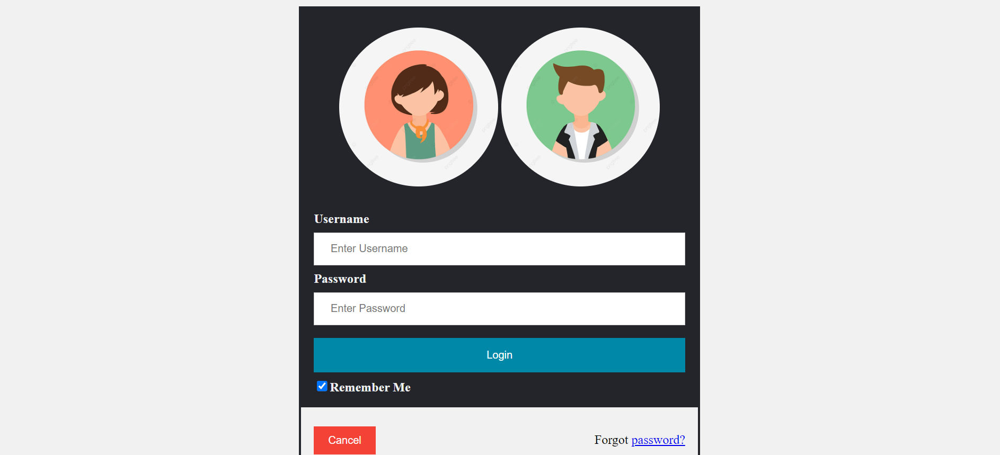
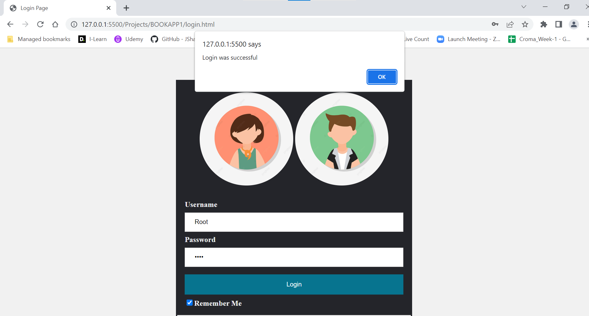
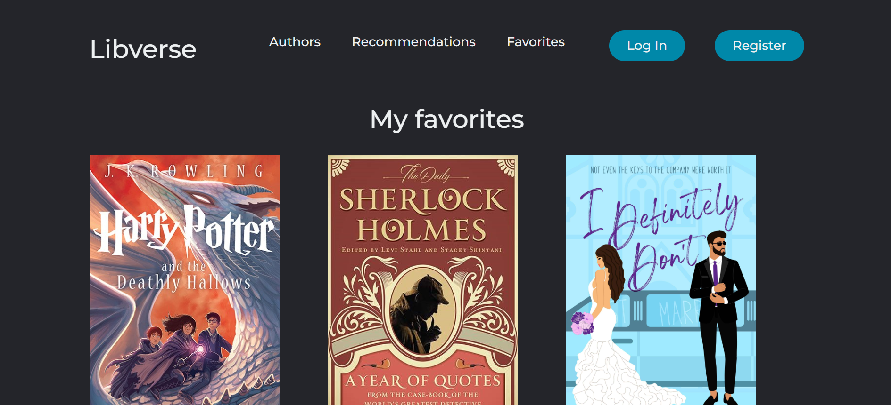

<h1> Book App </h1>
<h2> Homepage </h2>
Welcome to the homepage of our book app website. Here you can read thousands of our books anywhere anytime.  
1. You can search for books you want to read based on different genres such as action, comedy, romance, detective, thriller, mystery etc. from the searchbar which will direct you to the open library org.  
2. On the top right corner of the navigation bar, in case you are a new user, you can register your account else log in to your Libverse account and then have access to the books.  
3. You can also find links to authors, recommendations and your personal favorites at the top of the navigation bar.  

 

 
  <h2> Recommendations Page </h2>

 
  <h2> Registration Page </h2>

 
<h3> After you successfully register, a window pops up to confirm your registration and will direct you to the landing page. </h3>

 
  <h2> Login Page </h2>

  
  
  <h3> After you successfully login, a window pops up to confirm your login and will direct you to the landing page. </h3>

<h2> Your favorites section </h2>
This page will basically contain your favorite books which you wishlisted (added to your favorites list).

